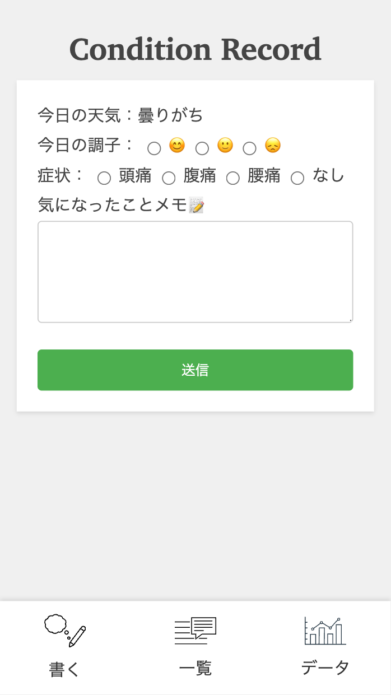

# kadai08-db1
PHP2 - DB連携サービス（作成・参照）

# ①課題番号-プロダクト名
Conditon Record　日々の体調記録アプリ　ver.2

## ②課題内容（どんな作品か）
- 日々の体調をつけるとともに、良くなった時のメモを残すことで、自分だけの処方箋になるようなアプリを作りました。

## ③DEMO
https://calthy-design.sakura.ne.jp/kadai07-php-basic/index.php

## ④工夫した点・こだわった点
- 先週の課題から欲しい機能を追加しました。
- 天気情報と症状別検索機能を追加しました。

## ④難しかった点・次回トライしたいこと(又は機能)
- データベースの登録やさくらサーバーとの接続でエラー続きで時間がかかってしまいました。課題のクリアに精一杯でした、、
- 

## ⑤質問・疑問・感想、シェアしたいこと等なんでも
- [質問] 
- [疑問] 
- [感想] Firebaseのデータ登録がとても難しかったのですが、PHPはまた別の難しさがあるなと思いました。
- [tips] 
- [参考記事] 

- ### スクリーンショット

